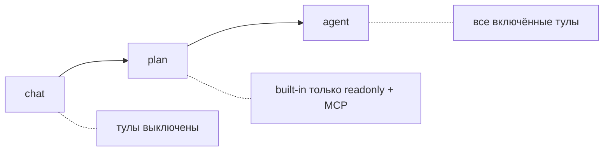
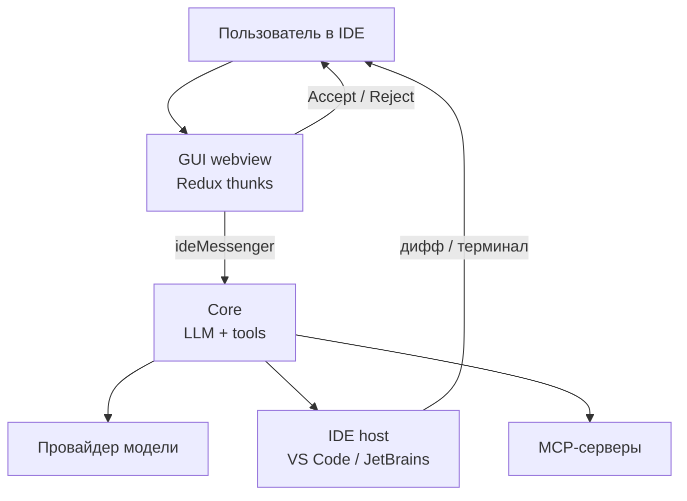
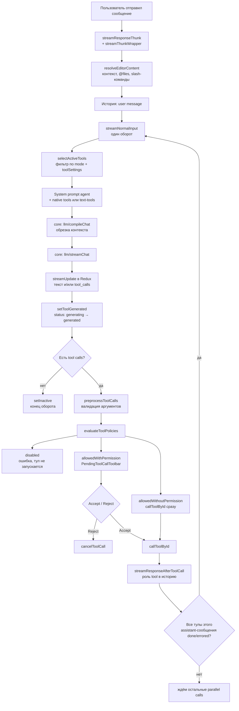
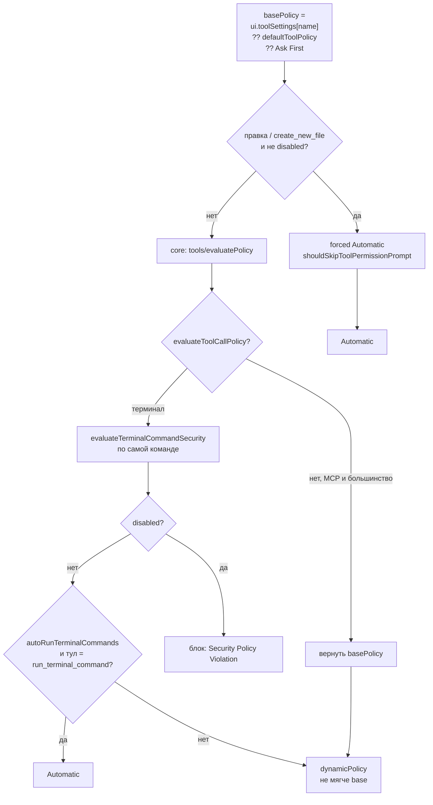
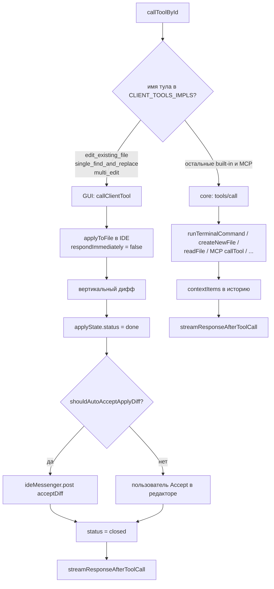
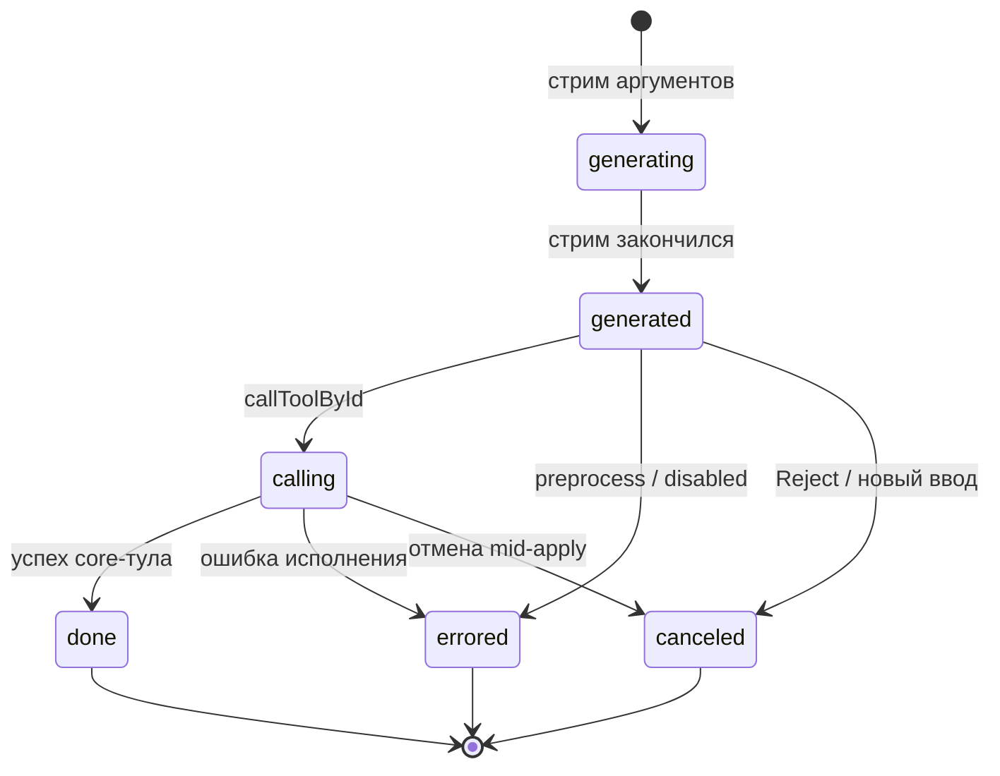

# Agent loop: обработка запроса

Документ описывает, как Continue в **agent mode** обрабатывает сообщение пользователя: стрим модели, вызов тулов, политики доступа и возврат в цикл.

Основной цикл живёт в GUI (webview), не в core. Core — LLM, компиляция контекста и исполнение большинства тулов. IDE — файлы, диффы, терминал.

Ключевые файлы:

| Шаг | Файл |
|---|---|
| Отправка сообщения | `gui/src/redux/thunks/streamResponse.ts` |
| Один оборот цикла | `gui/src/redux/thunks/streamNormalInput.ts` |
| Политики тулов | `gui/src/redux/thunks/evaluateToolPolicies.ts` |
| Запуск тула | `gui/src/redux/thunks/callToolById.ts` |
| Возврат в цикл | `gui/src/redux/thunks/streamResponseAfterToolCall.ts` |
| Правки в редакторе | `gui/src/redux/thunks/handleApplyStateUpdate.ts` |
| Кнопка Accept | `gui/src/components/mainInput/Lump/LumpToolbar/PendingToolCallToolbar.tsx` |
| Набор тулов по режиму | `gui/src/redux/selectors/selectActiveTools.ts` |
| Вызов тула в core | `core/core.ts` → `handleToolCall` → `core/tools/callTool.ts` |

## Режимы

`session.mode`: `chat` | `plan` | `agent`.

- **chat** — `selectActiveTools` возвращает `[]`. Модель отвечает текстом, правки только через Apply на кодблоке.
- **plan** — чтение и MCP. Built-in запись (`edit_*`, `create_new_file`, `run_terminal_command`) отфильтрованы.
- **agent** — полный набор включённых тулов. System prompt: `DEFAULT_AGENT_SYSTEM_MESSAGE` (`core/llm/defaultSystemMessages.ts`).

Дальше — только **agent**.

## Слои

Сообщения GUI ↔ core идут через `ideMessenger` (`llm/compileChat`, `llm/streamChat`, `tools/evaluatePolicy`, `tools/call`, `acceptDiff`).

## Главный цикл

Один пользовательский запрос может дать много оборотов: модель → тулы → результаты → снова модель, пока не придёт ответ без тулов.

`depth` в thunk — счётчик рекурсии (в тестах обрыв на 50). Параллельные тулы ждут, пока **все** вызовы текущего assistant-сообщения завершатся, и только тогда стартует следующий `streamNormalInput`.

## Что происходит внутри одного оборота

### 1. Сбор тулов и промпта

`streamNormalInput`:

1. `selectActiveTools` — не `disabled`, группа не `exclude`, mode = agent.
2. Опционально `applyToolOverrides` с модели.
3. Native tools, если модель умеет function calling. Иначе тулы описываются в system prompt (`SystemMessageToolCodeblocksFramework`), вызовы парсятся из стрима (`interceptSystemToolCalls`).
4. `constructMessages` — история + rules + system message.

### 2. Компиляция и стрим

`llm/compileChat` считает токены, при необходимости прунит историю (`didPrune`, `contextPercentage`). Если контекста не хватает — `out-of-context`, стрим стопается.

`llm/streamChat` шлёт чанки. GUI кладёт их в `session.history` через `streamUpdate`. Имена/аргументы тулов склеиваются в `addToolCallDeltaToState`.

После стрима вызовы со статусом `generating` переводятся в `generated`.

### 3. Preprocess

`tools/preprocessArgs` в core: нормализация путей и ранняя ошибка по аргументам. Битый вызов → `errored`, в цикл он не идёт как pending.

### 4. Политики

`evaluateToolPolicies` для каждого pending-вызова.

Смысл трёх политик:

| Политика | Поведение |
|---|---|
| `allowedWithoutPermission` | Тул запускается сразу |
| `allowedWithPermission` | Кнопка Accept / Reject, стрим стоит |
| `disabled` | Не выполняется, в чат пишется ошибка |

Для **терминала** Automatic в UI недостаточно: security по команде может поднять до Ask First (`go test`, `curl`) или `disabled` (`sudo`, `rm -rf /`). Флаг `autoRunTerminalCommands` обходит Ask First, но не `disabled`.

Для **MCP** `defaultToolPolicy` нет, дефолт — Ask First. Отдельной проверки команды нет: Automatic в Tools реально снимает Accept со всех вызовов этого тула.

Если в пачке есть хотя бы один Ask First, GUI не запускает остальные auto-approved **кроме** built-in readonly. Смесь «прочитай файл + выполни curl» прочитает файл и остановится на curl.

### 5. Исполнение

`callToolById` ставит статус `calling`, затем развилка:

Правки **не** заканчиваются в `callToolById`. `editImpl` только стартует apply и возвращает `respondImmediately: false` — стрим молчит, пока IDE не закроет дифф. `handleApplyStateUpdate` на `done` шлёт `acceptDiff` (в этой сборке для edit-тулов всегда, если тул не disabled). На `closed` пишет результат в tool output и вызывает `streamResponseAfterToolCall`.

Остальные тулы (терминал, создание файла, grep, MCP) выполняются в core синхронно относительно цикла: результат сразу кладётся в историю, статус `done` / `errored`.

### 6. Возврат к модели

`streamResponseAfterToolCall`:

1. Сообщение `role: tool` с выводом тула.
2. Если у assistant-сообщения ещё есть незакрытые вызовы — ждём.
3. Если все `done` / `errored` (опционально `canceled`, если `continueAfterToolRejection`) — снова `streamNormalInput`.

Модель видит результаты и либо вызывает тулы снова, либо отвечает текстом. Текстовый ответ без тулов → `setInactive`. Обёртка `streamThunkWrapper` сохраняет сессию.

## Статусы tool call

Для edit-тулов `calling` держится, пока дифф не `closed`. Потом `done` и следующий оборот.

## Когда цикл останавливается

- Модель ответила без tool calls.
- Есть Ask First, пользователь ещё не нажал Accept (пауза, не конец сессии).
- Пользователь Reject / отправил новое сообщение (pending тулы отменяются в `Chat.sendInput`).
- Abort стрима (Cmd/Ctrl+Backspace).
- Нет модели, out-of-context, фатальная ошибка стрима.

## Что изменено в этой сборке (2.0.1)

Оригинальный Continue в agent mode всё равно ставит Accept на многие действия. Здесь цикл тот же, меняется только развилка политик:

- правки и `create_new_file` пропускают Accept на туле;
- дифф после apply принимается сам;
- терминал при включённом Auto-run не останавливается на Ask First от security (опасные команды по-прежнему `disabled`);
- MCP по умолчанию по-прежнему Ask First — этот цикл их не автоподтверждает.
