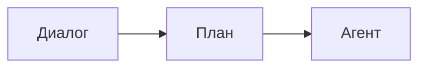
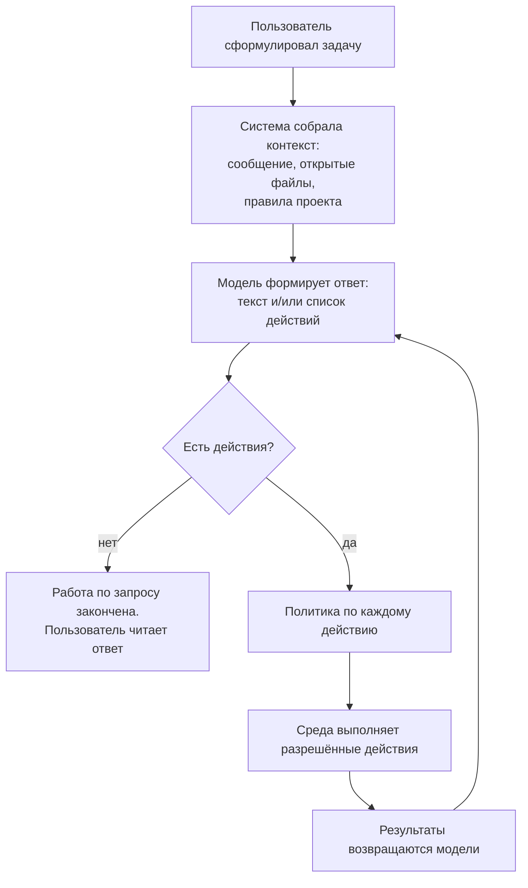
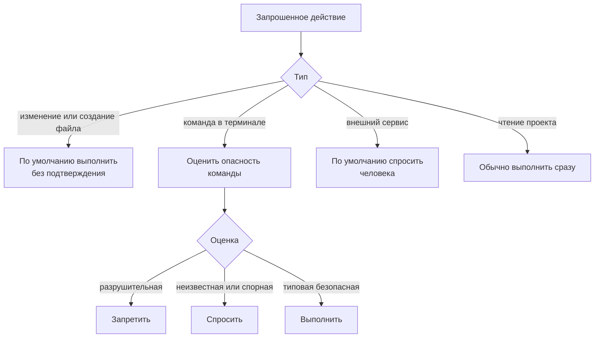
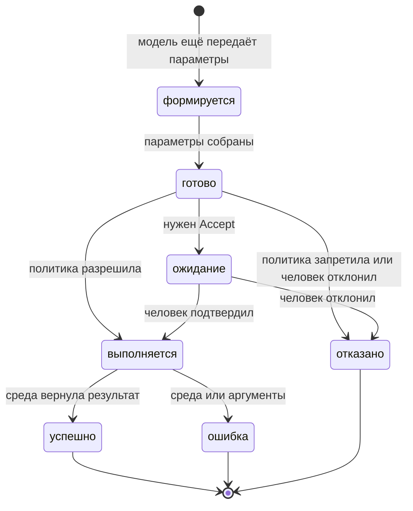

# Как работает агентский режим

Описание процесса обработки запроса. Не привязано к реализации: это логика системы глазами аналитика.

## Задача системы

Пользователь формулирует намерение («почини тест», «добавь ручку API»). Система в агентском режиме сама решает, что прочитать, что изменить и какие команды запустить, пока задача не будет закрыта или не потребуется человек.

Это не чат с подсказками. Это цикл «подумал → сделал → посмотрел результат → подумал снова».

## Участники

| Роль | Что делает |
|---|---|
| Пользователь | Задаёт цель, подтверждает рискованные действия, может остановить работу |
| Агент (модель) | Планирует шаги, выбирает действия, интерпретирует результаты |
| Среда разработки | Даёт доступ к файлам, терминалу, диффам, внешним сервисам |
| Политика доступа | Решает, действие выполняется сразу, ждёт согласия или запрещено |

Пользователь не обязан знать, какой внутренний шаг сейчас идёт. Он видит ход работы, результаты и точки, где система просит разрешение.

## Три режима работы

Система умеет три уровня автономии.

**Диалог.** Система только отвечает. Файлы и команды сама не трогает. Правки, если нужны, предлагает текстом — применить их должен пользователь.

**План.** Система исследует проект (читает код, смотрит структуру) и составляет план. Менять код и запускать команды записи она не должна. Внешние подключённые инструменты обычно доступны, потому что система не отличает «чтение» от «записи» у чужого сервиса.

**Агент.** Система получает набор действий и крутит цикл до ответа, отказа пользователя или запрета политики.

Дальше описан только агентский режим.

## Общая картина цикла

Один запрос пользователя — это не один ответ модели, а серия оборотов.

Пока модель считает, что задача не решена, она запрашивает новые действия. Когда достаточно объяснить результат человеку — цикл останавливается.

## Из чего состоит один оборот

### 1. Постановка задачи

Пользователь отправляет сообщение. К нему может быть приложен контекст: выделенный код, файлы по ссылке, правила репозитория.

Система собирает историю разговора и текущий набор разрешённых действий. Если действия выключены целиком, модели прямо говорят: инструментов нет, не пытайся их вызывать.

### 2. Решение модели

Модель получает:

- роль («ты агент, правки делай инструментами, а не текстом в чат»);
- историю;
- описания доступных действий (прочитать файл, найти по проекту, изменить файл, создать файл, выполнить команду, вызвать внешний сервис).

На выходе — обычный текст, набор действий или оба сразу.

Действия могут идти пачкой: например, прочитать три файла параллельно. Следующий оборот начнётся только когда пачка завершится.

### 3. Проверка корректности

Перед запуском система смотрит, понятны ли аргументы (путь к файлу, текст команды). Сломанный вызов не выполняется: модели возвращают ошибку, она может попробовать иначе.

### 4. Политика: сразу, спросить, запретить

Каждое действие проходит через правила. Это отдельный слой, не решение модели.

Три исхода:

| Решение | Смысл |
|---|---|
| Разрешить | Среда выполняет действие, человек не нажимает кнопку |
| Спросить | Цикл встаёт на паузу, пока человек не подтвердит или не отклонит |
| Запретить | Действие не выполняется, модели сообщают, что политика это закрыла |

Важно: «инструмент включён» и «этот конкретный вызов можно выполнить» — разные вещи. Терминал может быть разрешён как класс действий, но конкретная команда всё равно уйдёт в запрет или в вопрос.

Если в одной пачке есть и безопасное, и требующее согласия, безопасное (обычно чтение) может уйти сразу, а спорное будет ждать человека.

### 5. Исполнение в среде

После разрешения действие уходит в среду разработки.

Два разных контура:

**Быстрые действия.** Чтение файла, поиск, команда в терминале, вызов внешнего сервиса. Система дожидается результата (или таймаута / ошибки) и сразу отдаёт его модели.

**П правки в файлах.** Сначала в редакторе появляется предлагаемый дифф. Это второй барьер: даже если вызов инструмента уже разрешён, изменение ещё можно принять или отклонить в редакторе. В текущей постановке продукта правки, которые прошли политику, принимаются автоматически, чтобы агент не останавливался на каждой строке.

Команда в терминале не помнит предыдущие: каждая — новый процесс. «Перейди в папку и потом собери» как два шага с памятью сессии не работает; нужна одна команда или явные пути.

Внешние сервисы (подключаемые инструменты) система не анализирует по содержимому вызова так же глубоко, как shell. Для них политика почти целиком «спросить / не спросить этот инструмент», а не «эта конкретная операция безопасна».

### 6. Наблюдение и следующий ход

Результаты (содержимое файла, вывод команды, «файл создан», текст ошибки) становятся новым сообщением в истории от имени инструмента. Когда все действия текущей пачки завершены, модель снова получает слово.

Она может:

- запросить ещё действия;
- исправить подход после ошибки;
- остановиться и ответить пользователю.

Ошибка инструмента — не конец цикла. Это входные данные: «не получилось, сделай иначе».

## Состояния одного действия

Пользователь в интерфейсе в основном видит: «сейчас выполняется», «нужно подтверждение», «готово», «нельзя».

## Когда процесс заканчивается

Нормальное завершение: модель дала текстовый ответ и не запросила новых действий.

Пауза, но не конец: система ждёт Accept. Сессия жива, пользователь может подтвердить, отклонить или написать новое сообщение.

Принудительная остановка:

- пользователь отправил новую реплику — незакрытые действия отменяются;
- пользователь прервал выполнение;
- кончилось место в контексте разговора;
- нет выбранной модели или произошёл сбой канала.

## Границы ответственности

**Модель** решает *что* сделать. Она может ошибаться, повторять шаги, вызывать лишние действия.

**Политика** решает *можно ли это сделать без человека*. Она не понимает цель задачи, только класс риска.

**Среда** делает *как*: открывает файл, запускает процесс, показывает дифф. Она не интерпретирует намерение пользователя.

**Человек** задаёт цель и остаётся последней инстанцией на рискованных шагах. В этой версии продукта типовые правки, создание файлов и (при включённой настройке) обычные команды терминала человеку не показывают. Разрушительные команды и, по умолчанию, внешние сервисы — показывают или блокируют.

## Типовые сценарии

**«Почини падающий тест».** Модель читает тест и код → меняет файл (без клика) → запускает тест в терминале → смотрит вывод → при необходимости правит ещё раз → пишет, что готово.

**«Удали всё в корне диска».** Модель может сформировать команду. Политика запрещает. Действие не выполняется. Модель получает отказ и должна остановиться или предложить безопасный вариант.

**«Сходи во внешний сервис и создай тикет».** Инструмент внешнего сервиса по умолчанию ждёт подтверждения на каждый вызов, пока человек не переведёт этот инструмент в автоматический режим. Автоматический режим здесь означает *все* вызовы этого сервиса, без разбора «безопасный / нет».

## Что важно для продукта

Цикл агента — это не «один запрос = один ответ», а повторяющийся контур наблюдения и действия.

Узкое место для пользователя — не модель, а точки остановки: подтверждение действия и подтверждение диффа. Слишком много остановок — агент бесполезен. Слишком мало — риск необратимых команд и слепых вызовов внешних систем.

Текущий баланс: файловые правки и относительно безопасный терминал идут сами; разрушительное — никогда; внешние сервисы — пока с вопросом.
